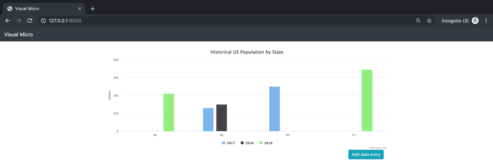
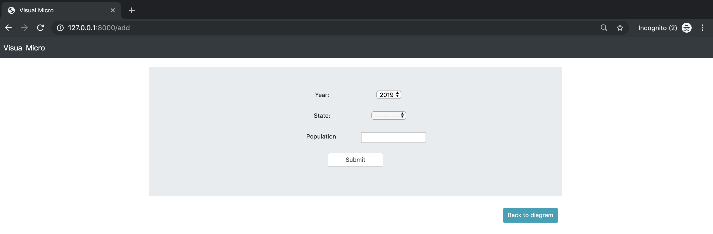
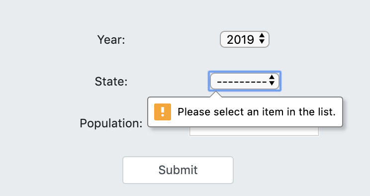
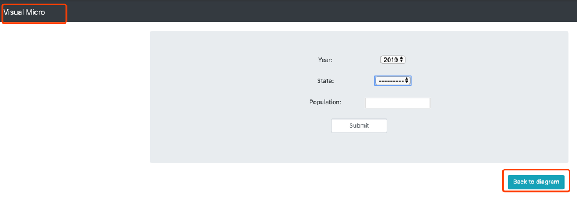

# Description
This project visualizes data for historical US population by state.

- Backend: Django
- Frontend: Bootstrap + Highcharts.js
- Database: MySQL

# Instructions

## make sure you have python3 and django installed

## clone this project to your local machine

```
git clone https://github.com/jumoni/Visual-micro.git
```

## enter into the project root directory

```
cd Visual-micro
```

## change mysql settings in 'webapp/settings.py' to make sure it matches with mysql settings on your own machine 

```
DATABASES = {
    'default': {
        'ENGINE': 'django.db.backends.mysql',
        'NAME': 'visualizer', -> database name
        'USER': 'root', -> user name
        'PASSWORD': '123456', -> user password
        'HOST': 'localhost', 
        'PORT': '3306', -> mysql port on your machine
    }
}
```

## start server

```
python manage.py runserver
```

## open '127.0.0.1:8000' in your browser, you will see the diagram page (initially no data to display, this page will refresh every 10 seconds)



## click the 'Add data entry' button, you will go to the add page



# enter data for 'year', 'state' and 'population' and click the 'submit' button, if failed, please follow the instructions on the popup hints



# if you want to go back to home page, you can either click the button 'back to diagram' or just click the website title




